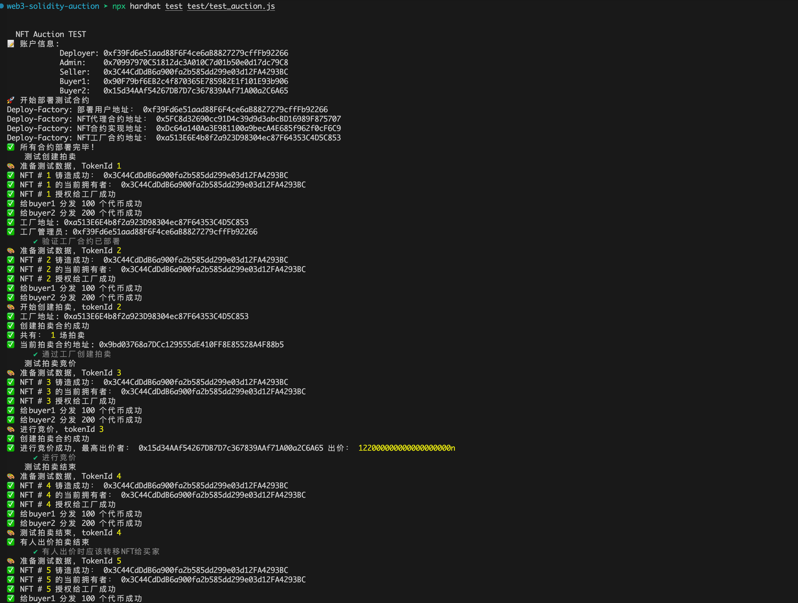
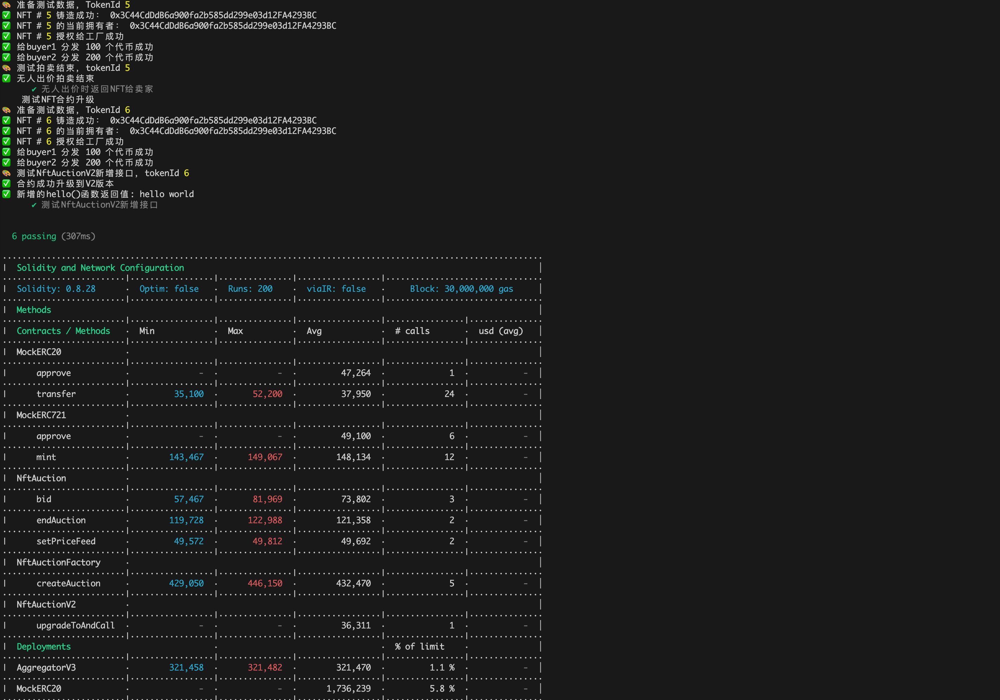

## 1. 系统概述

本系统基于Solidity语言开发的以太坊NFT拍卖智能合约

### 1.1 系统功能
- ✅ NFT拍卖管理
- ✅ 价格预言机集成
- ✅ 拍卖合约、工厂合约安全可升级性
- ✅ 工厂模式部署
- ✅ 多代币支持【ETH/ERC20】
- ❌ 跨链竞拍【CCIP】
  
### 1.2 项目结构
```
web3-solidity-auction
├─ 📁contracts
│  ├─ 📁mock                                #测试mock合约目录                
│  │  ├─ 📄AggregatorV3.sol                 #语言机
│  │  ├─ 📄MockERC20.sol                    #mock ERC20合约
│  │  └─ 📄MockERC721.sol                   #mock ERC721合约
│  ├─ 📄NftAuction.sol                      #拍卖合约实现
│  ├─ 📄NftAuctionFactory.sol               #拍卖工厂合约
│  └─ 📄NftAuctionV2.sol                    #拍卖合约升级版本
├─ 📁deploy                                 #部署脚本目录
│  ├─ 📁.cache                              #元数据目录
│  │  └─ 📄proxyNftAuctionFactory.json      #元数据
│  ├─ 📄01_deploy_auction.js                #拍卖合约部署脚本
│  ├─ 📄01_deploy_auctionFactory.js         #工厂合约部署脚本
│  └─ 📄02_upgrade_auction.js               #升级合约部署脚本
├─ 📁test                                   #测试脚本目录
│  └─ 📄test_auction.js                     #测试脚本
```

### 1.3 技术栈
- **合约语言**: Solidity
- **开发框架**: Hardhat
- **测试框架**: Mocha
- **语言机**: Chainlink Data Feeds
- **代理模式**: OpenZeppelin UUPS
- **跨链协议**: CCIP

## 2. 合约介绍

### 2.1 NftAuction.sol 

#### 功能描述
NftAuction.sol 是一个 NFT 拍卖合约，用于实现 NFT 的拍卖功能。该合约使用 OpenZeppelin 的 UUPS 代理模式，实现了可升级性

#### 拍卖合约结构体
```solidity
struct Auction {
    address seller; // 拍卖人地址
    uint256 startTime; // 起拍时间
    uint256 duration; // 拍卖持续时间
    uint256 startPrice; // 起拍价格
    uint256 highestBid; // 最高出价
    address highestBidder; // 最高出价人地址
    bool ended; // 是否结束
    address nftContract; // NFT合约地址
    uint256 tokenId; // NFT代币ID
    address tokenAddress; // 竞拍代币地址
}
```

#### 函数列表
```solidity
// 拍卖
function setAuctionParams(
        address _nftContract,
        uint256 _tokenId,
        uint256 _startPrice,
        uint256 _duration
    )

function bid(address _tokenAddress, uint256 _amount)
function endAuction()
function getAuctionInfo()

// 语言机
function setPriceFeed(address _nftAddress, address _priceFeed) 
function getLatestPrice(address _tokenAddress)
```

### 2.2 NftAuctionV2.sol

#### 功能描述
NftAuctionV2.sol 是 NftAuction 拍卖合约的升级版本，主要用于测试合约升级

#### 新增函数
```solidity
function hello() 
```

### 2.3 NftAuctionFactory.sol

#### 功能描述
NftAuctionFactory.sol 是 NftAuction 拍卖合约的工厂合约，主要用于创建新的 NftAuction 合约实例

#### 函数列表
```solidity
function createAuction(
        address nftAddress,
        uint256 tokenId,
        uint256 startPrice,
        uint256 duration
    )
function getAuctions()
function updateAuctionImplementation(
        address _newAuctionImplementation
    )
```

## 3. 测试脚本
测试脚本位于 `test/test_auction.js` 文件中，该脚本主要测试了 NftAuctionFactory 的创建拍卖合约和查询拍卖合约的功能

### 3.1 测试结果

