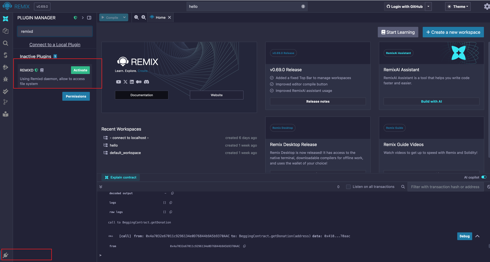
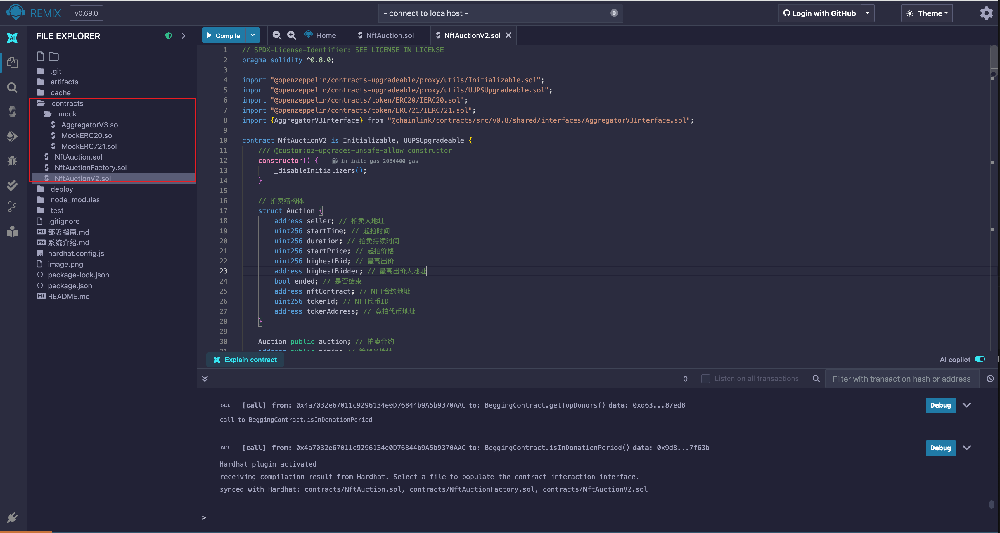
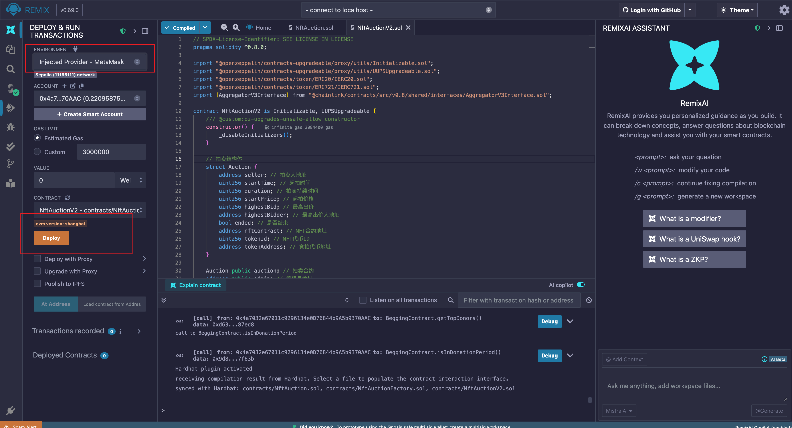

## 部署步骤

### 1. 环境准备
```bash
# 1.1 安装hardhat【已存在node环境】
npx hardhat --init # 使用V2版本

# 1.2 安装依赖包
npm install hardhat-deploy
npm install @openzeppelin/contracts-upgradeable
npm install @openzeppelin/contracts
npm install @chainlink/contracts
npm install dotenv

# 1.3 编译
npx hardhat compile

# 1.4 启动本地节点
npx hardhat node
```

### 2. 配置环境变量
```javascript
// hardhat.config.js 配置
module.exports = {
  solidity: "0.8.20",
  networks: {
    sepolia: {
      url: process.env.SEPOLIA_URL,
      accounts: [process.env.PRIVATE_KEY]
    }
  }
};
```

### 3. 本地网络部署
```bash
# 部署工厂合约和实现合约【工厂直接会部署对应的NftAuction、NftAuctionV2合约】
npx hardhat run deploy/01_deploy_auctionFactory.js --network localhost

# 创建拍卖 【单独创建一个NftAuction合约实例】
npx hardhat run deploy/01_deploy_auction.js --network localhost

# 升级合约 【单独升级一个NftAuction合约实例】
npx hardhat run deploy/02_upgrade_auction.js --network localhost
```

### 4. 本地测试
```bash
# 运行指定脚本测试
npx hardhat test test/test_auction.js
```
### 5. Remix部署

#### 5.1 安装依赖
```bash
# 安装remixd
npm install -g @remix-project/remixd

# 启动remixd
npx remixd
```

#### 5.2 Remix远程连接

1. 访问Remix官网 https://remix.ethereum.org/
2. 点击左侧菜单plugin Manager
3. 搜索 remixd，进行连接


#### 5.3 选择网络
1. 以此将所有合约compile


2. 选择网络【sepolia】，依次进行部署


3. 功能测试

### 6 测试覆盖
- ✅ 工厂合约部署测试
- ✅ 拍卖创建测试
- ✅ 竞拍功能测试
- ✅ 合约升级测试
- ✅ 价格预言机测试